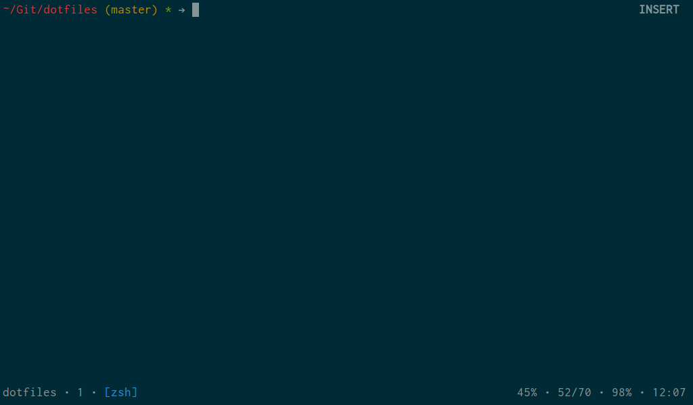

# Dotfiles

Welcome to my `~/`.

## Flavor

[Manjaro Minimal Net Edition](http://manjaro.org/)

## Prerequisites

~~~ sh
sudo pacman -S base-devel yaourt git
git clone https://github.com/gummesson/dotfiles.git Git/dotfiles
~~~

### Keyboard

If the `Fn` keys act up, run:

~~~ sh
sudo keyboardctl --set-layout se
~~~

## Installation

`cd` into `Git/dotfiles`, take a look in the `Makefile` and execute at will.

## Setup

### Wifi

~~~ sh
nmtui
~~~

### TLP

See the [ArchWiki](https://wiki.archlinux.org/index.php/TLP#Installation).
